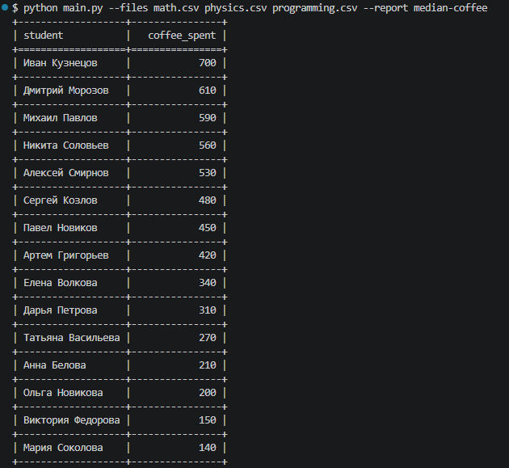

### Description.
- Тестовый проект для собеседования в компанию Workmate.
- Главная фишка - медианная сумма трат на кофе по каждому студенту.
##
### С чего начать?

```yaml
git clone <URL>
```
##
*Windows*
```yaml
# Виртуалка.
python -m venv venv
source venv/Scripts/activate
# Обновление pip.
python -m pip install --upgrade pip
# Зависимости.
pip install -r requirements.txt
```
##
*Linux*
```yaml
# Виртуалка.
python3 -m venv venv
source venv/bin/activate
#Обновление pip.
python3 -m pip install --upgrade pip
#Зависимости.
pip install -r requirements.txt
```
##

### Нужные таблицы для теста уже в репе, поэтому для запуска скрипта используй:
```yaml
python main.py --files math.csv physics.csv programming.csv --report median-coffee
```


